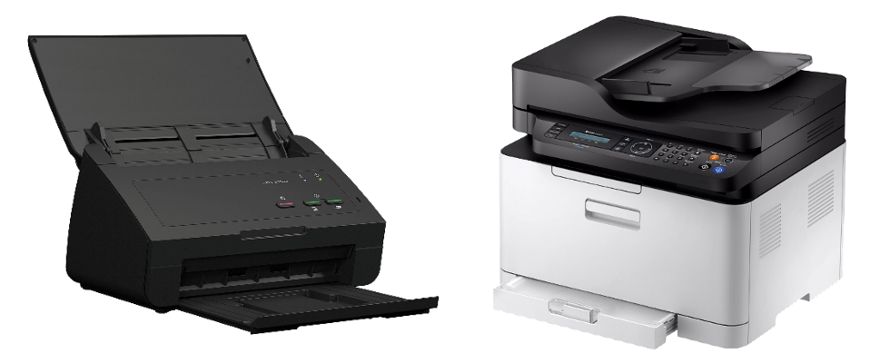
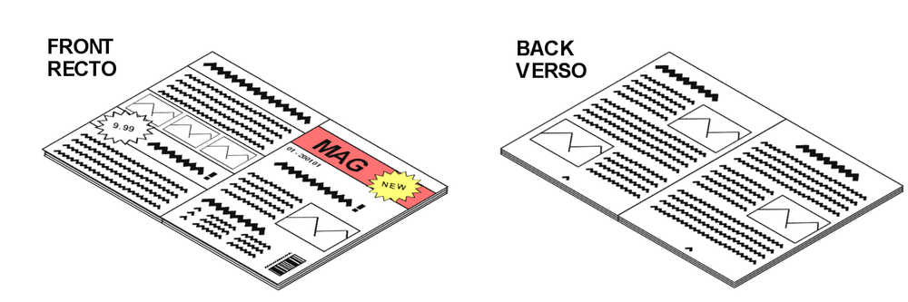
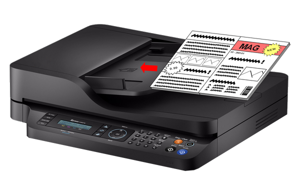
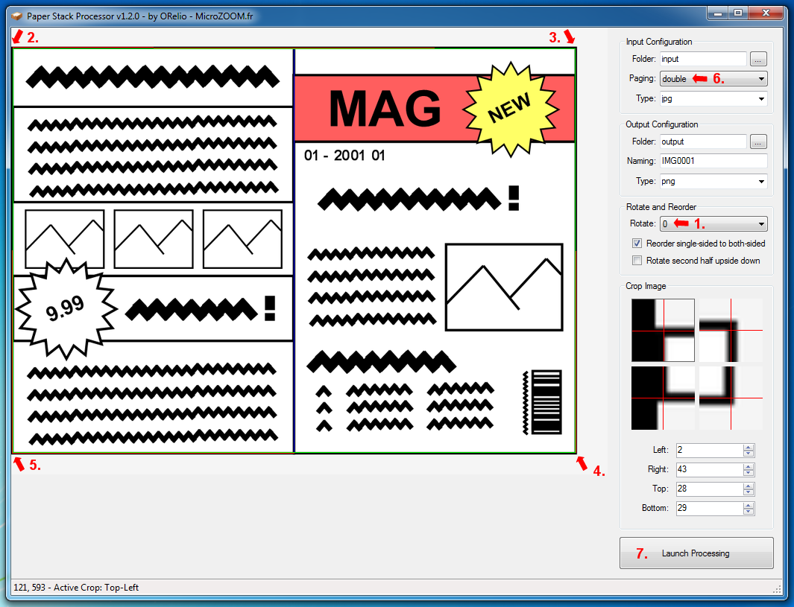
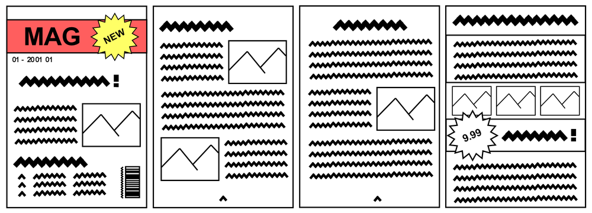
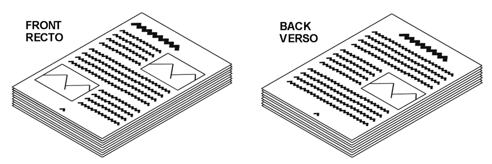
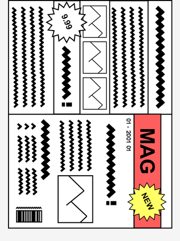
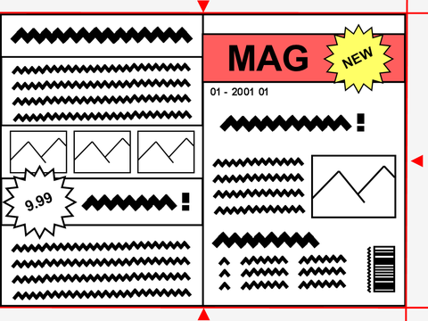
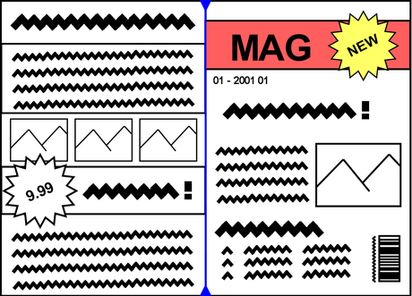
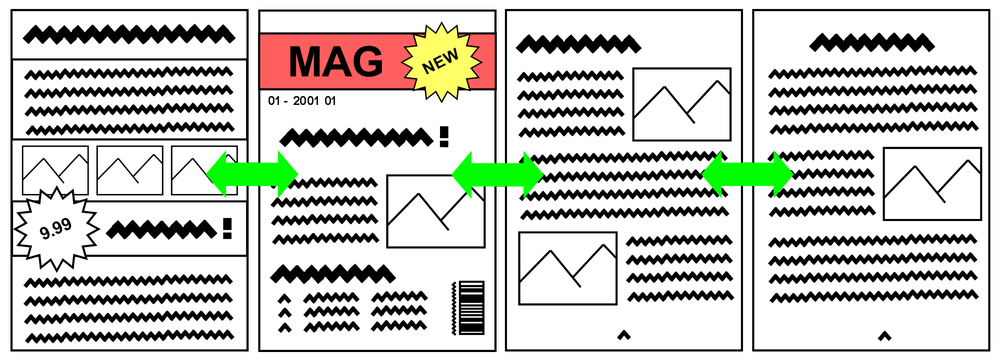

# Paper Stack Processor

This program automates the processing of paper stack scans by combining basic batch operations:

* Rotate
* Crop
* Split
* Reorder

Although it can serve other needs, its typical use case is in conjunction with a single-sided ADF scanner, which takes paper sheets using a paper feeder and scans the front side of each page. This type of scanner is typically found standalone or as part of a multifunction printer:



Paper Stack Processor will process raw images from the scanner into single pages in correct order. For scanning magazines, you'll likely need a scanner supporting A3 paper.

# Usage Example

Example below using an unstapled magazine:



Scan all front pages (recto), by placing the stack in the paper feeder:



When scanning, set the input size to A3 instead of autodetect, and make sure scan format is set to JPEG as Paper Stack Processor does not support PDF.

Do the same operation another time to scan the verso of your paper stack. Then, place all the resulting images from the scanner in an empty folder and select it as Input folder in Paper Stack Processor :



Rotate the input image if needed (1). Select all 4 corners of the magazine (2, 3, 4, 5), then adjust paging to `double` (6) and click `Launch processing` (7). Paper Stack Processor will handle the croping, splitting and reordering, then output single pages as PNG files:



The same process can apply to simple A4 paper stacks :



The only difference being that Input paging must be set to `single` in GUI.

Afterwards, you'll likely want to optimize image size by reducing resolution and compressing to JPEG. For that purpose, you can use the batch mode of [RIOT - Radical Image Optimization Tool](https://riot-optimizer.com/).

You can zip the images and rename your `.zip` archive to `.cbz`, then conveniently read your scanned magazine using programs such as [CDisplayEx](https://www.cdisplayex.com/).

# How it works

The main procedure of Paper Stack Processor is divided in 4 successive stages.

## Rotate

This is a typical raw image scan from a magazine:



Since the magazine is scanned in landscape orientation, but treated as portait by the scanner, the resulting image will likely need to be rotated by 90 or 270 degrees. This is done prior to any other operation.

Command-line argument: `--rotate <0|90|180|270>`

## Crop

Once rotated, the image needs cropping. This is done by specifying the amount of pixels to remove on left, right, top and bottom.



Command-line argument: `--crop-<left|right|top|bottom> <amount>`

## Split

Each image contains 2 pages, and therefore requires to be split into 2 images:



Command-line argument: `--input-paging <single|double|double-rtl>`

Split is automatically performed in the middle of the image. `double-rtl` is used for right-to-left paging and affects reordering.

## Reorder



Finally, reordering will rename images into `IMG0001`, `IMG0002`, etc.


Command-line argument: `--reorder`

# Command-line usage

When configuring the GUI, a [batch file](UtilityScripts/PostProcess.bat) is generated. Processing can be launched directly using the batch file without opening the GUI. When launching the GUI, settings are read back from the batch file.

If running Mac or Linux, you might prefer the command-line usage:

```
$ mono PostProcess.exe

== Argument Name    Default        Description ==
 --input-dir        (mandatory)    Input directory to read images from
 --output-dir       (mandatory)    Output directory to write images to
 --rotate           0              Rotate input images by 0, 90, 180 or 270 degrees
 --crop-left        0              After rotating, remove pixel columns on the left
 --crop-right       0              After rotating, remove pixel columns on the right
 --crop-top         0              After rotating, remove pixel lines on the top
 --crop-bottom      0              After rotating, remove pixel lines on the bottom
 --input-ext        jpg            Input image file type, supports jpg, jpeg, png, bmp
 --input-paging     single         'double'/'double-rtl': Split pages in 2 after rotate/crop
 --output-ext       png            Output image file type, supports jpg, jpeg, png, bmp
 --output-basename  IMG0001        Base naming of output files, number must be placed last
 --reorder          true           Reorder pages, assuming input is all front then all back
 --backflip         false          Handle second half of the input stack placed upside down
 --gui              (none)         Launch GUI and set other arguments in GUI settings
```

On Windows, the default action without argument is to launch the GUI. Use `--help` for displaying command-line help instead.

# License

Paper Stack Processor is provided under [CDDL-1.0](http://opensource.org/licenses/CDDL-1.0) ([Why?](http://qstuff.blogspot.fr/2007/04/why-cddl.html)).

Basically, you can use it or its source for any project, free or commercial, but if you improve it or fix issues,
the license requires you to contribute back by submitting a pull request with your improved version of the code.
Also, credit must be given to the original project, and license notices may not be removed from the code.

The [Normal Paper Box Icon](http://www.iconarchive.com/show/vista-artistic-icons-by-awicons/1-Normal-Paper-Box-icon.html) is provided under [CC Attribution 3.0 Unported](https://creativecommons.org/licenses/by/3.0/) by [Icons by Lokas Software](https://www.awicons.com/).